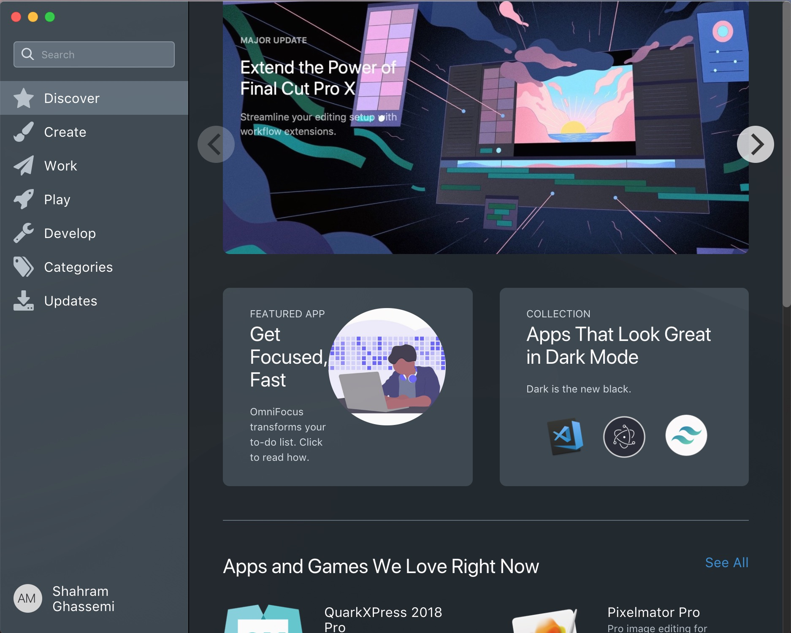
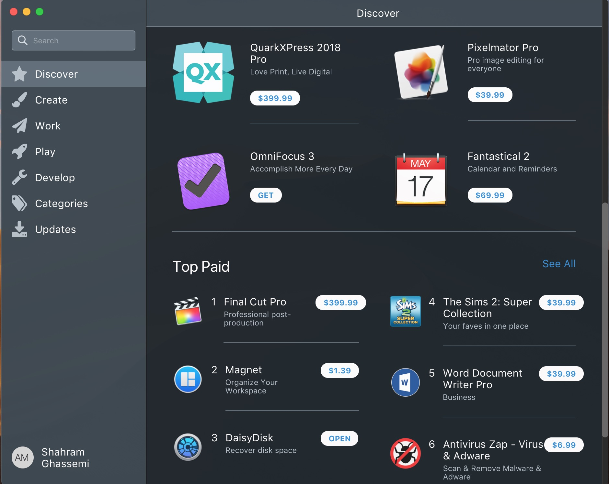

# Vue-Electron-Store
Vue-Electron-Store is a Vue.js and Electorn made desktop application which is a simulated redesigned app store with dark mode for viewing and downloading apps.

Technologies used: 
Vue.js 
Electron 
Tailwind CSS 
Animate.css 
Vue-Flickity 
Vue Router 
Vuex 

You can download the project, use "npm install" to install the files, and then "npm run electron:serve" to run the app to get a feel for how the app works and looks. You can also watch the demo video by clicking the url in this repository.

Here is the landing page.

  

When you scroll down on the discover page, you can view more information about the apps.

  
